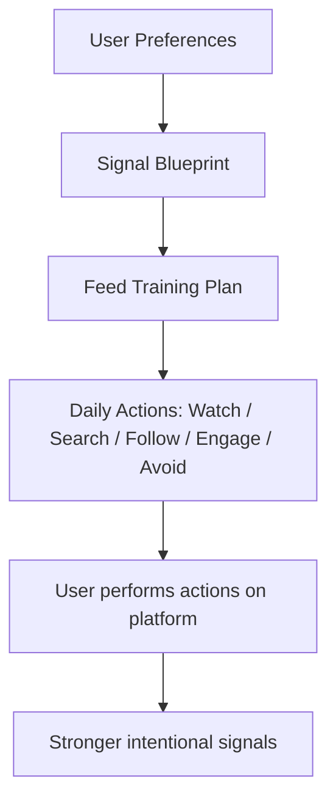

# FeedSmith

An intentional feed‑training planner that turns your interests into a daily action plan for shaping the content you want to see.

Repository: https://github.com/Senpai-Akash/FeedSmith

## Overview

FeedSmith is a client‑side Next.js application that helps users define what they want to see in their social feeds and converts those preferences into a deterministic, human‑readable Signal Blueprint and a 7‑day Feed Training Plan. The app guides users with watch/search/follow/engage/avoid actions they can perform manually to strengthen intentional signals. FeedSmith does not, and cannot, control or modify third‑party recommendation systems.

## How it works

The running application implements a simple, deterministic pipeline that maps saved preferences into a structured plan. The flow is:



## Core concept

1. Define your interests — choose topics and set relative strength (0–100).
2. Define content preferences — indicate format bias (educational, tutorials, etc.).
3. Define unwanted content — mark filters to reduce (e.g. "Celebrity content").
4. Generate a training plan — the app deterministically creates a Signal Blueprint and a 7‑day training plan with concrete actions.
5. Follow the plan — the user performs recommended actions manually on the target platforms.

FeedSmith is explicitly a planning/intelligence layer — it does not automate interactions or access platform internals.

## Example (illustrative)

User preferences (example):

- Interests: Programming 90, Cats 60
- Content preferences: Tutorials 90, Educational 85
- Filters: Celebrity, Clickbait

Sample Day 1 — Establish (example output):

WATCH
- Programming tutorials
- Cat videos (educational)

SEARCH
- "Python programming"; "coding tutorials"

FOLLOW / SUBSCRIBE
- A couple of relevant creators you identify and choose to follow

ENGAGE
- Like/save content you genuinely want more of

AVOID
- Celebrity content; Clickbait

Note: the above is an example. Actual actions are generated deterministically from saved preferences.

## Features (implemented)

- Interest selection and strength (UI under `/build`)
- Content‑style preferences (educational, tutorials, entertainment, etc.)
- Feed filters (user‑specified strings to avoid)
- Local persistence of preferences in `localStorage`
- Deterministic Signal Blueprint generation (`src/lib/feed/blueprint.ts`)
- 7‑day Feed Training Plan generation (`src/lib/feed/training.ts`) and UI (`/build/profile`)
- A simple recommendation/scoring engine running against deterministic mock content (`src/lib/feed/recommendation.ts`, `src/lib/feed/mockContent.ts`) with a `/feed` UI
- Client‑side visualizations and motion via Framer Motion and custom components (orbit visualization, molten background)

## Architecture (high level)

User Input → Preference Model → Signal Blueprint → Feed Training Engine → Training Plan → Profile / Mission UI

- UI: `src/app/*`, `src/components/*`
- Domain / business logic: `src/lib/feed/*` (preferences, blueprint, training, recommendation)
- Data / types: `src/lib/feed/types.ts`
- Persistence: browser `localStorage` (see `src/lib/feed/preferences.ts`)

## Project structure (important parts)

```
src/
├─ app/                # Next.js routes and pages (/, /build, /feed, /build/profile)
├─ components/         # Reusable UI components and landing pieces
└─ lib/
	 └─ feed/            # Core domain logic: preferences, blueprint, training, recommendation, mock data
```

Files of note:

- `src/app/build/page.tsx` — feed builder UI
- `src/app/build/profile/page.tsx` — generated 7‑day training plan and progress
- `src/app/feed/page.tsx` — ranked feed view powered by `MOCK_CONTENT`
- `src/lib/feed/*.ts` — deterministic logic (blueprint, training, recommendation)

## Tech stack

- Next.js 16 (app router)
- React 19 + TypeScript
- Tailwind CSS
- Framer Motion (animations)
- OGL (visual effects)

These are taken from `package.json` and the source tree.

## Getting started

### Prerequisites

- Node.js (compatible with the Next.js version used) and npm

### Installation

Clone the repository and install dependencies:

```bash
git clone https://github.com/Senpai-Akash/FeedSmith.git
cd FeedSmith
npm install
```

### Development

Run the dev server:

```bash
npm run dev
```

Open http://localhost:3000 in your browser.

### Production build

```bash
npm run build
npm start
```

### Scripts

- `npm run dev` — start development server
- `npm run build` — build for production
- `npm start` — run built app
- `npm run lint` — run ESLint

No runtime environment variables are required for the app to run locally; the application is client‑side and uses `localStorage` for persistence.

## Usage (current flow)

1. Open the app and click "Build my feed" or navigate to `/build`.
2. Select interests and set strength sliders.
3. Tune content style preferences and select filters to avoid.
4. Review the generated Signal Blueprint and the 7‑day Feed Training Plan at `/build/profile`.
5. Visit `/feed` to see the ranked recommendations against bundled mock content.

Only the actions described in the UI are implemented — there are no integrations that perform actions on external platforms.

## Design philosophy

FeedSmith is built around intentional user behaviour rather than automation. It helps users answer:

- "What signals am I sending?" and
- "What should I intentionally do if I want more of this type of content?"

The code deliberately uses simple, deterministic algorithms so results are explainable and auditable.

## Platform limitations

- FeedSmith does not access or modify third‑party recommendation systems.
- It does not automate likes, follows, comments, saves, or subscriptions.
- The app provides guidance only; users must perform actions themselves on the target platforms.

## Roadmap

### Completed

- Interest selection, strength sliders, and local persistence
- Content preference sliders and filter list
- Signal Blueprint generation (deterministic)
- 7‑day Feed Training Plan generation and UI
- Simple recommendation/scoring against mock content and a feed UI

### Planned (not implemented)

- Server‑side persistence and user accounts
- Official platform discovery / verified creator suggestions
- Platform‑specific integrations (explicitly gated and opt‑in)
- More extensive analytics and progress tracking
- Expanded mock datasets and A/B tuning of plan heuristics

## Contributing

1. Fork the repository on GitHub.
2. Create a feature branch: `git checkout -b feature/your-change`.
3. Implement changes and run the app locally to verify.
4. Open a pull request describing the change.

Please keep UI changes minimal and avoid altering the deterministic logic in `src/lib/feed` without tests or clear rationale.

## License

No license file is present in this repository. Licensing information has not yet been specified.

---

README.md created to document the current implementation, features and roadmap. See `src/lib/feed` for deterministic logic and `src/app` for the UI routes described above.
